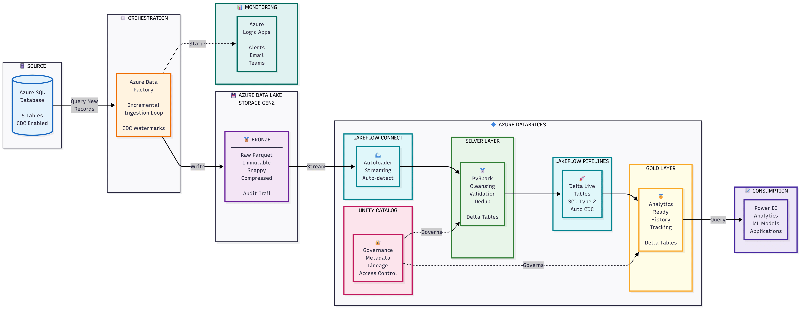

# Azure Spotify Data Pipeline


A production-grade data engineering solution that orchestrates Spotify streaming data from Azure SQL Database through a medallion architecture (Bronze → Silver → Gold) using Azure Data Factory and Databricks Delta Live Tables.

## Overview

This project implements an **end-to-end ETL pipeline** that ingests Spotify streaming analytics data incrementally, processes it through multiple transformation layers, and delivers analytics-ready datasets using modern data lakehouse patterns.

### Key Highlights

- **Incremental CDC-based data extraction** from Azure SQL Database
- **Medallion Architecture** with Bronze, Silver, and Gold layers
- **Slowly Changing Dimensions (SCD Type 2)** for historical tracking
- **Delta Live Tables** for streaming transformations
- **Automated monitoring and alerting** via Azure Logic Apps
- **Multi-environment deployment** (Dev/Prod) with Databricks Asset Bundles

## Architecture




### Data Flow
```
┌─────────────────────────────────────────────────────────────────────┐
│                        Azure SQL Database                           │
│  • DimUser      • DimTrack      • DimDate                          │
│  • DimArtist    • FactStream                                       │
└────────────────────────┬────────────────────────────────────────────┘
                         │
                         ▼ ADF Incremental Ingestion (CDC-based)
┌─────────────────────────────────────────────────────────────────────┐
│                    Bronze Layer (ADLS Gen2)                         │
│  • Raw Parquet files with Snappy compression                       │
│  • CDC metadata tracking (JSON)                                    │
│  • Exactly-once semantics                                          │
└────────────────────────┬────────────────────────────────────────────┘
                         │
                         ▼ Databricks Autoloader + Transformations
┌─────────────────────────────────────────────────────────────────────┐
│                    Silver Layer (Delta Tables)                      │
│  • Data cleansing and normalization                                │
│  • Deduplication on natural keys                                   │
│  • Business logic transformations                                  │
│  • Schema evolution support                                        │
└────────────────────────┬────────────────────────────────────────────┘
                         │
                         ▼ Delta Live Tables (DLT)
┌─────────────────────────────────────────────────────────────────────┐
│                     Gold Layer (Delta Tables)                       │
│  • SCD Type 2 dimensions (DimUser, DimTrack, DimDate, DimArtist)  │
│  • Streaming fact tables (FactStream)                             │
│  • Data quality expectations                                       │
│  • Analytics-ready datasets                                        │
└────────────────────────┬────────────────────────────────────────────┘
                         │
                         ▼
                   Analytics & BI Tools
```

## Tech Stack

| Component | Technology |
|-----------|-----------|
| **Orchestration** | Azure Data Factory |
| **Data Processing** | Databricks (Spark, Delta Lake, DLT) |
| **Storage** | Azure Data Lake Storage Gen2 (ADLS) |
| **Source Database** | Azure SQL Database |
| **Languages** | Python, PySpark, SQL |
| **Data Format** | Parquet, Delta Lake, JSON |
| **Monitoring** | Azure Logic Apps |
| **Version Control** | Git |
| **Deployment** | Databricks Asset Bundles (DAB) |

## Features

### 1. Incremental Data Loading
- **Change Data Capture (CDC)** tracks last processed timestamps
- Only extracts changed/new records from source
- Metadata stored in JSON files for each table
- Optimized for cost and performance

### 2. Medallion Architecture

#### Bronze Layer
- Raw data ingestion from Azure SQL
- Parquet format with Snappy compression
- Preserves original data structure
- Automated folder cleanup for empty incremental loads

#### Silver Layer
- **DimUser**: Uppercase normalization, deduplication
- **DimTrack**: Duration classification (low/medium/high), name normalization
- **DimArtist**: Deduplication on artist_id
- **DimDate**: Date dimension processing
- **FactStream**: Streaming events processing

#### Gold Layer
- **SCD Type 2** for dimensions (tracks historical changes)
- **Streaming tables** for fact data
- **Data quality expectations** (NOT NULL constraints)
- **Auto CDC flows** for real-time synchronization

### 3. Data Quality & Validation
- Schema evolution detection via Autoloader
- Data quality expectations in DLT pipelines
- Custom validation UDFs (email validation)
- Deduplication on natural keys

### 4. Monitoring & Alerting
- Pipeline success/failure alerts via Azure Logic Apps
- Execution metadata tracking (run ID, timestamp)
- WebActivity integration for real-time notifications

## Project Structure
```
azure-spotify-pipeline/
├── Databricks/
│   └── .bundle/spotify_dab/dev/files/
│       ├── databricks.yml               # Bundle configuration
│       ├── resources/
│       │   └── spotify_dab_etl.pipeline.yml  # DLT pipeline config
│       └── src/
│           ├── gold/dlt/                # Gold layer transformations
│           │   ├── transformations/
│           │   │   ├── DimUser.py       # SCD Type 2 user dimension
│           │   │   ├── DimTrack.py      # SCD Type 2 track dimension
│           │   │   ├── DimDate.py       # SCD Type 2 date dimension
│           │   │   └── FactStream.py    # Streaming fact table
│           │   └── utilities/
│           │       └── utils.py         # Validation utilities
│           └── silver/
│               └── silver_Dim.py        # Silver transformations
│
├── pipeline/
│   ├── incremental_ingestion_looped.json # Main production pipeline
│   └── incremental_ingestion.json       # Single-table pipeline
│
├── linkedService/
│   ├── AzureDataLakeStorage1.json       # ADLS connection
│   └── AzureSqlDatabase1.json           # SQL Database connection
│
├── dataset/
│   ├── azure_sql.json                   # SQL table dataset
│   ├── parquet_dynamic.json             # Dynamic Parquet dataset
│   └── Json_dynamic.json                # CDC metadata dataset
│
├── factory/
│   └── df-spotify-pipeline.json         # ADF factory config
│
└── loop_input                           # Pipeline loop configuration
```

## Pipeline Details

### Azure Data Factory Pipeline: `incremental_ingestion_looped`

This is the main production pipeline that processes all 5 tables in a loop:

| Table | Schema | CDC Column | Description |
|-------|--------|-----------|-------------|
| DimUser | dbo | updated_at | User dimension |
| DimTrack | dbo | updated_at | Track dimension |
| DimDate | dbo | date | Date dimension |
| DimArtist | dbo | updated_at | Artist dimension |
| FactStream | dbo | stream_timestamp | Streaming events |

**Pipeline Steps:**
1. **Set Current Timestamp** - Record execution time
2. **Lookup Last CDC Value** - Read from metadata JSON
3. **Incremental Copy** - Extract changed records from SQL
4. **Conditional Processing** - Update metadata if data exists, cleanup if empty
5. **Get Max CDC Value** - Determine new watermark
6. **Update CDC Metadata** - Store for next run
7. **Send Alert** - Notify via Logic Apps webhook

### Databricks Transformations

#### Silver Layer (`silver_Dim.py`)
- Uses **Databricks Autoloader** for streaming reads
- Applies business transformations:
  - User name uppercase conversion
  - Track duration classification: low (<150s), medium (150-300s), high (>300s)
  - Track name normalization (remove "- " prefix)
- Deduplication on primary keys
- Drops rescued data columns

#### Gold Layer (Delta Live Tables)
- **SCD Type 2** implementation with start/end dates
- Streaming table definitions
- Data quality constraints:
```python
  @dlt.expect("valid_user_id", "user_id IS NOT NULL")
```
- Auto CDC flows for historical tracking

## Prerequisites

- Azure Subscription with the following services:
  - Azure Data Factory
  - Azure SQL Database
  - Azure Data Lake Storage Gen2
  - Azure Databricks Workspace
  - Azure Logic Apps (for alerts)
- Databricks CLI installed
- Git for version control

## Setup & Deployment

### 1. Azure Resources Setup
```bash
# Create resource group
az group create --name rg-spotify-pipeline --location eastus

# Deploy Azure SQL Database
az sql server create --name azureprojectvaishak --resource-group rg-spotify-pipeline
az sql db create --name azurespotifydb --server azureprojectvaishak

# Create ADLS Gen2 Storage Account
az storage account create --name vnspotify --resource-group rg-spotify-pipeline --enable-hierarchical-namespace true

# Create Databricks Workspace
az databricks workspace create --name spotify-databricks --resource-group rg-spotify-pipeline
```

### 2. Azure Data Factory Deployment
```bash
# Clone repository
git clone https://github.com/yourusername/azure-spotify-pipeline.git
cd azure-spotify-pipeline

# Deploy ADF resources
# Use Azure DevOps or manual deployment via Azure Portal
```

### 3. Databricks Bundle Deployment
```bash
cd Databricks/.bundle/spotify_dab/dev/files

# Authenticate
databricks auth login

# Deploy to development
databricks bundle deploy --target dev

# Deploy to production
databricks bundle deploy --target prod
```

### 4. Configure Linked Services

Update the following files with your connection strings:
- `linkedService/AzureDataLakeStorage1.json`
- `linkedService/AzureSqlDatabase1.json`

### 5. Run the Pipeline
```bash
# Trigger ADF pipeline
az datafactory pipeline create-run \
  --factory-name df-spotify-pipeline \
  --name incremental_ingestion_looped \
  --resource-group rg-spotify-pipeline
```

## Data Model

### Dimension Tables
- **DimUser**: user_id, user_name, email, country, subscription_type, updated_at
- **DimTrack**: track_id, track_name, album_name, duration_ms, popularity, updated_at
- **DimArtist**: artist_id, artist_name, genre, followers, updated_at
- **DimDate**: date_key, date, year, month, day, quarter, day_of_week

### Fact Table
- **FactStream**: stream_id, user_id, track_id, artist_id, date_key, stream_timestamp, play_duration_ms, skip_flag

## Monitoring & Operations

### Pipeline Monitoring
- Azure Data Factory monitoring dashboard
- Pipeline run history and metrics
- Activity-level execution details

### Alerting
- Success/failure notifications via Azure Logic Apps
- Webhook integration with email or Teams
- Custom alert thresholds

### Data Quality
- DLT expectations enforce NOT NULL constraints
- Autoloader handles schema drift automatically
- Checkpoint-based exactly-once processing

## Performance Optimization

- **Partitioning**: Data partitioned by date in ADLS
- **Compression**: Snappy compression for Parquet files
- **Incremental Loading**: Only process changed data
- **Serverless Compute**: Databricks serverless SQL/Spark for auto-scaling
- **Delta Lake**: ACID transactions and time travel